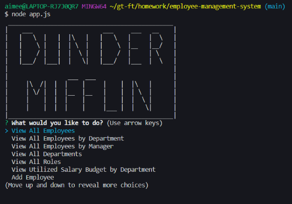
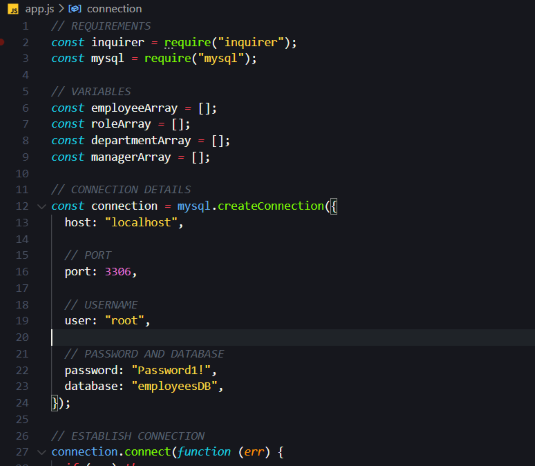
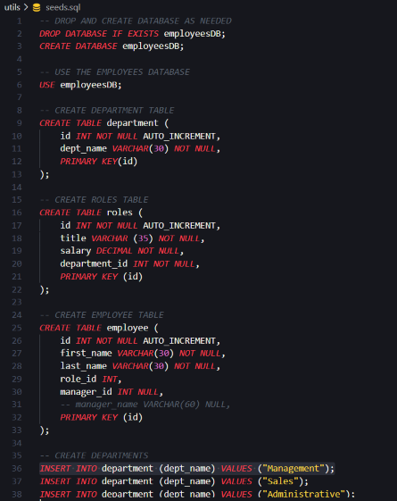
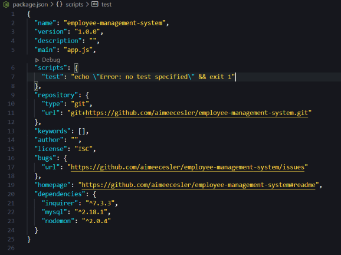
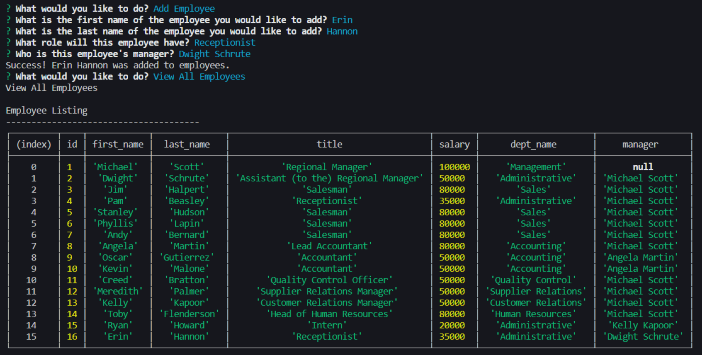
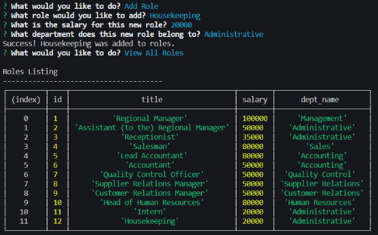
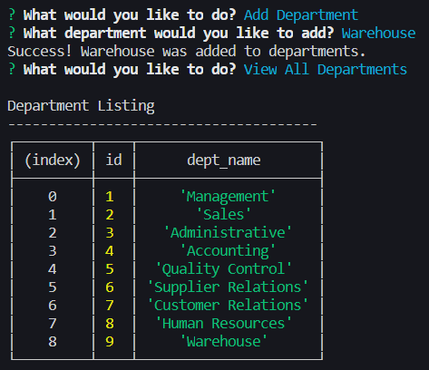
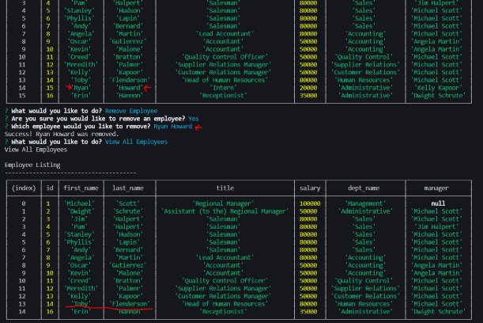
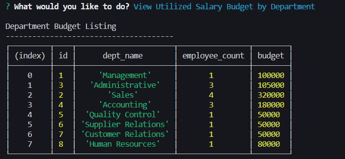

# EMPLOYEE MANAGEMENT SYSTEM

The purpose of this repository is to create a command line application where a company can track and update their employee's data.

---

## Table of Contents

- [Installation](#installation)
- [Usage](#Usage)
- [Building the Employee Management System](#building-the-employee-management-system)
- [Minimum Requirements](#minimum-requirements)
- [Credits](#credits)
- [Resources](#resources)
- [Links](#Links)
- [License](#license)

---

## Installation

1. Follow the GitHub Repository Link in the [links](#Links) section below.
1. Clone the repository using an SSH key.
1. Open GitBash and use "git clone" to clone the repository.
1. Run npm install to install associated modules.

---

## Usage

Edit using VSCode after [installation](#installation). JavaScript, JSON and seed SQL files are provided.

---

---

---

## Building the Employee Management System

Upon opening this command line application, the user will be presented with the company logo as well as a main menu with various options. Details of these options are listed below.
* View All Employees
    * If the user selects this option, they will be presented with a table that includes the employee ID, first name, last name, jon title, department, salary and manager name.
* View All Employees by Department
    * If the user selects this option, they will be presented with a table that has all the information listed above, and it is sorted by department.
* View All Employees by Manager
    * If the user selects this option, they will be presented with a table that has all the information listed above, and it is sorted by manager.
* View All Departments
    * If the user selects this option, they will be presented with a table that includes the department ID and department name.
* View All Roles
    * If the user selects this option, they will be presented with a table that includes the role ID, title, salary and department name.
* View Utilized Salary Budget by Department
    * If the user selects this option, they will be presented with a table that includes a listing of each department name and ID, along with a count of the employees in that department and a total salary budget for that department.
* Add Employee
    * If the user selects this option, they will be presented with a series of questions to create a new employee, including first name, last name, role, and manager. Once these details have been provided, a new employee will be made based on the information given.
* Remove Employee
    * If the user selects this option, they will be asked to confirm that they do, in fact, want to delete an employee, giving them the opportunity to return to the main menu if they select no. If they select yes, the user will be given a list of employees and prompted to chose which employee they would like to remove. Once chosen, the selected employee will be removed from the database.
* Edit Employee
    * If the user selects this option, they will be asked to confirm that they do, in fact, want to edit an employee, giving them the opportunity to return to the main menu if they select no. If they select yes, the user will be given a list of employees and prompted to chose which one they would like to edit. Once chosen, the user will then select which parameters they would like to change and then answer questions based on those selections. Once all questions are answered, the given updates will be made to the database.
* Add Department
    * If the user selects this option, they will be presented with a series of questions to create a new department. Once these details have been provided, a new department will be made based on the information given.
* Remove Department
    * If the user selects this option, they will be asked to confirm that they do, in fact, want to delete a department, giving them the opportunity to return to the main menu if they select no. If they select yes, the user will be given a list of departments and prompted to chose which one they would like to remove. Once chosen, the selected department will be removed from the database.
* Edit Department
    * If the user selects this option, they will be asked to confirm that they do, in fact, want to edit a department, giving them the opportunity to return to the main menu if they select no. If they select yes, the user will be given a list of departments and prompted to chose which one they would like to edit. Once chosen, the user will then select which parameters they would like to change and then answer questions based on those selections. Once all questions are answered, the given updates will be made to the database.
* Add Role
    * If the user selects this option, they will be presented with a series of questions to create a new role, including title, salary and department. Once these details have been provided, a new role will be made based on the information given.
* Remove Role
    * If the user selects this option, they will be asked to confirm that they do, in fact, want to delete a role, giving them the opportunity to return to the main menu if they select no. If they select yes, the user will be given a list of roles and prompted to chose which one they would like to remove. Once chosen, the selected role will be removed from the database.
* Edit Role
    * If the user selects this option, they will be asked to confirm that they do, in fact, want to edit a role, giving them the opportunity to return to the main menu if they select no. If they select yes, the user will be given a list of roles and prompted to chose which one they would like to edit. Once chosen, the user will then select which parameters they would like to change and then answer questions based on those selections. Once all questions are answered, the given updates will be made to the database.
* Exit
    * If the user selects this option, the connection will end and the app will close.

---

---

---

---

---

## Minimum Requirements

* Functional application. :heavy_check_mark:

* GitHub repository with a unique name and a README describing the project. :heavy_check_mark:

* The command-line application should allow users to:

  * Add departments, roles, employees :heavy_check_mark:

  * View departments, roles, employees :heavy_check_mark:

  * Update employee roles :heavy_check_mark:

### Bonus

* The command-line application should allow users to:

  * Update employee managers :heavy_check_mark:

  * View employees by manager :heavy_check_mark:

  * Delete departments, roles, and employees :heavy_check_mark:

  * View the total utilized budget of a department -- ie the combined salaries of all employees in that department :heavy_check_mark:

---

## Credits

As always, a huge thanks to our instructional staff for all their hard work!

## Resources

- [w3schools](https://www.w3schools.com)
- [Node.js](https://nodejs.org/en/)
- [MySQL](https://www.mysql.com/)
- [Inquirer](https://www.npmjs.com/package/inquirer)

---

## Links

[Repository Link](https://github.com/aimeecesler/employee-management-system)

[Demonstration Video](https://drive.google.com/file/d/1fEARzqbKqEfLZUUPVHUzaPHgRnO6GI0-/view)

---

## License

Copyright &copy; 2020 Aimee Corbin Esler

    Permission is hereby granted, free of charge, to any person obtaining a copy
    of this software and associated documentation files (the "Software"), to deal
    in the Software without restriction, including without limitation the rights
    to use, copy, modify, merge, publish, distribute, sublicense, and/or sell
    copies of the Software, and to permit persons to whom the Software is
    furnished to do so, subject to the following conditions:

    The above copyright notice and this permission notice shall be included in all
    copies or substantial portions of the Software.

    THE SOFTWARE IS PROVIDED "AS IS", WITHOUT WARRANTY OF ANY KIND, EXPRESS OR
    IMPLIED, INCLUDING BUT NOT LIMITED TO THE WARRANTIES OF MERCHANTABILITY,
    FITNESS FOR A PARTICULAR PURPOSE AND NONINFRINGEMENT. IN NO EVENT SHALL THE
    AUTHORS OR COPYRIGHT HOLDERS BE LIABLE FOR ANY CLAIM, DAMAGES OR OTHER
    LIABILITY, WHETHER IN AN ACTION OF CONTRACT, TORT OR OTHERWISE, ARISING FROM,
    OUT OF OR IN CONNECTION WITH THE SOFTWARE OR THE USE OR OTHER DEALINGS IN THE
    SOFTWARE.
